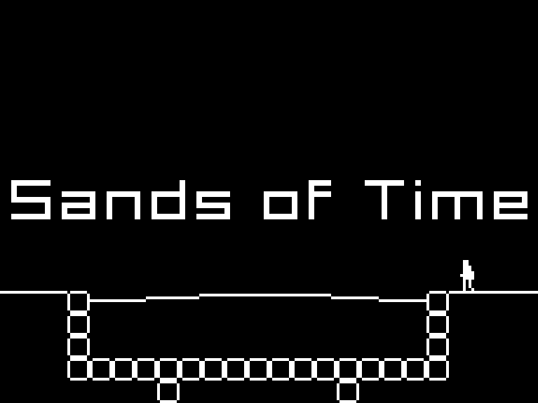

# Sands of Time

You're an archaeologist exploring the ruins of an empire that's been gone for centuries. Learn about its people, reconnect with the past e re-learn what's been forgotten.

This game is a submission to [1-BIT Jam](https://itch.io/jam/1-bit-jam-8). You can play this game on a web browser or download Windows and Linux versions on its [itch.io page](https://eldskald.itch.io/sands-of-time).

## Credits

All code, art and sound effects done by me, [Rafael Bordoni](https://github.com/eldskald). I used [Godot Engine](https://godotengine.org/) to make the game, [Aseprite](https://www.aseprite.org/) to make the art and [rFXGen](https://raylibtech.itch.io/rfxgen) to make the sound effects, so thanks to all the developers of these tools.

The music was done by [Trevor Lentz](https://opengameart.org/users/trevor-lentz).

## License

The source code, art and sound effects are [CC0](https://creativecommons.org/public-domain/cc0/), the font is [CC BY-ND 2.5](https://creativecommons.org/licenses/by-nd/2.5/) and the music is [CC BY-SA 3.0](https://creativecommons.org/licenses/by-sa/3.0/) More details on license files.
